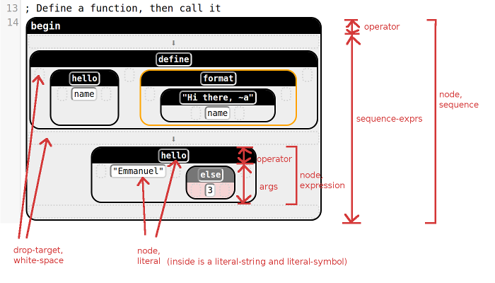

# Stylesheet Guide

[TODO] This documentation was written early in the development of this
project. Before releasing it, check it all against the code, which may
have changed in the meantime.

This is a brief overview of how to make your language's
[less-css](http://lesscss.org/) style file.

Your style file should look like this:

    .blocks-language-MY_LANG {
      @border-radius: 5px;
      OTHER_PARAMS
      ...
      @import "default-style.less"; // use appropriate path to this file

      SET_STYLES
      ...
    }

The rest of this documentation has two sections, describing (i) the
parameters you need to set, and (ii) the css classes you can tweak the
style of.

## Parameters

`default-style.less` can take a number of parameters (more
specifically `less` variables). Here they are, together with some
reasonable defaults. To set these, define them _after_ importing
`default-style.less`.

### Sizes

- **border-radius**:  The radius of the curve at the edges of blocks.
    Zero would make them rectangles.
    
        @border-radius: 5px;

- **border-width**: The width of the border of a block.

        @border-width: 1px;

### Colors

- **name-color**: The color for variable names.

        @name-color: steelblue;

- [TODO: unused] **comment-color**: The color of comments.

        @comment-color: #ccc;

- **border-color**: The default border color for blocks.

        @border-color: block;

- **editing-border-color**: The border color for the block you are
  currently at.

        @editing-border-color: orange;

- **error-border-color**: The border color for a block containing an
  error, such as [FILL].

        @error-border-color: red;

- **hover-border-color**: The border color for a block being hovered over
  with the mouse cursor.

        @hover-border-color: rgba(255, 165, 0, 0.3);

- **drag-drop-background-color**: When dragging a block over an empty
  spot, this color highlights this potential drop location.

        @hover-drop-background-color: lightblue;

- **drag-replace-background-color**: When dragging a block over a spot
    that's taken, this color highlights this potential replacement.

        @hover-replace-background-color: red;

## CSS Classes

Here is a list of the css classes you may want to change the
appearance of. There are a few more obscure classes in
`src/less/default-style.less`, but you would only need to modify
those under unusual circumstances.

### Block Classes

Every block has the `blocks-node` css class:

- **blocks-node**: _Any_ block

- **blocks-node[aria-selected^="true"]**: A block that is currently
  selected.

- **blocks-node[aria-expanded="false"]**: A folded/collapsed block

In addition, every `blocks-node` also has a more specific class that
says what kind of node it is. The options for this more specific class
are:

- **blocks-literal**: A block containing literal data, such as a
  string or number.

- **blocks-sequence**: A vertical sequence of blocks, such as used by
  Scheme's `begin`.

- **blocks-TYPE**: A block of the given (non-literal) type. What TYPE
    can be is defined by your language.

- **blocks-hole**: This represents a part of the program that hasn't
  been filled in yet.

- **blocks-unknown**: A block of unknown type.

- **blocks-locked**: "Locking" allows you to make certain blocks
    opaque to novice users. This is the css class of locked blocks.

Most typical blocks have two parts: an `operator` (the black bar up
top), and an `args` (the space below that contains its children):

- **operator**: The "head" of a node, shown by default in a black bar
  at the top of the block.

- **args**: The "children" of a node, shown by default in a light gray
  section at the bottom of the block.

If a node is a `blocks-sequence`, however, it contains a
`sequence-exprs` instead of an `args`:

- **sequence-exprs**: The "children" of a `blocks-sequence`. By
  default, these are shown with arrows between them.

And if a node is a literal, it instead contains a span with a more
specific css class, for that particular literal:

- **blocks-literal-TYPE**: A literal of type TYPE. This is contained
    _inside_ of a span of class `blocks-literal`. What TYPE can be is
    defined by your language.

Some blocks have spaces that you can drop a block onto. These spaces
have the css class `blocks-drop-target`, as well as `blocks-white-space`:

- **blocks-drop-target**: A spot that you can drag a block onto.

Here is a diagram showing most of the css classes. The classes are
written without the `blocks-` prefix.

<!--
  internal use
    .blocks-identifierList
    .blocks-editing
    .blocks-over-target
    .blocks-white-space
    .blocks-dragging
-->

### Other Classes

- **searchBox**: The box that pops up when you search with `/`.
